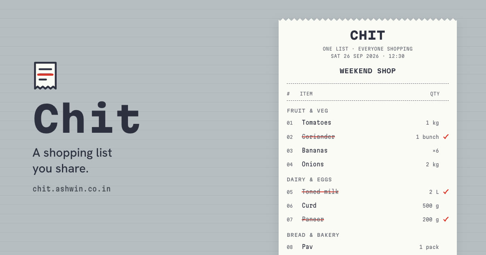
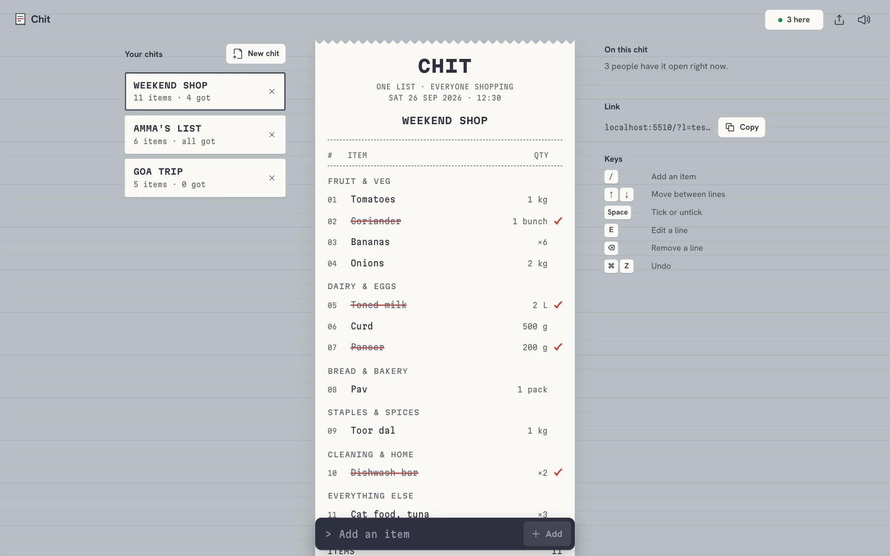
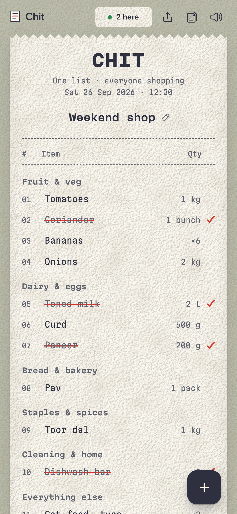
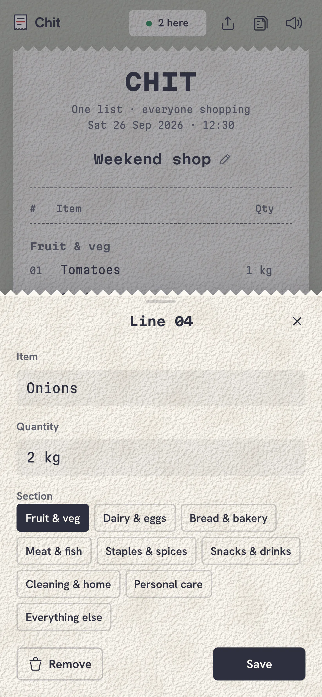
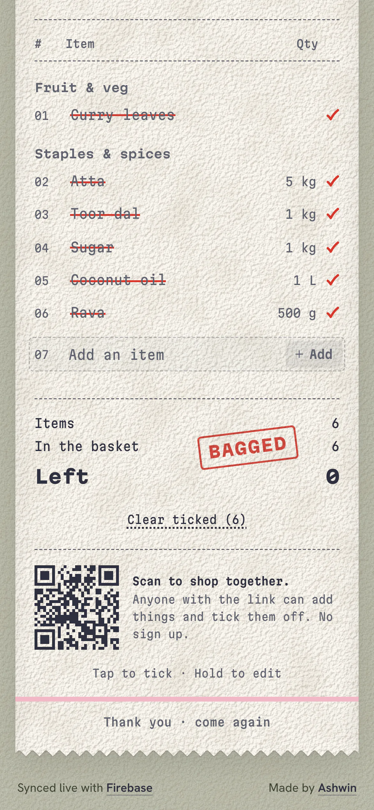
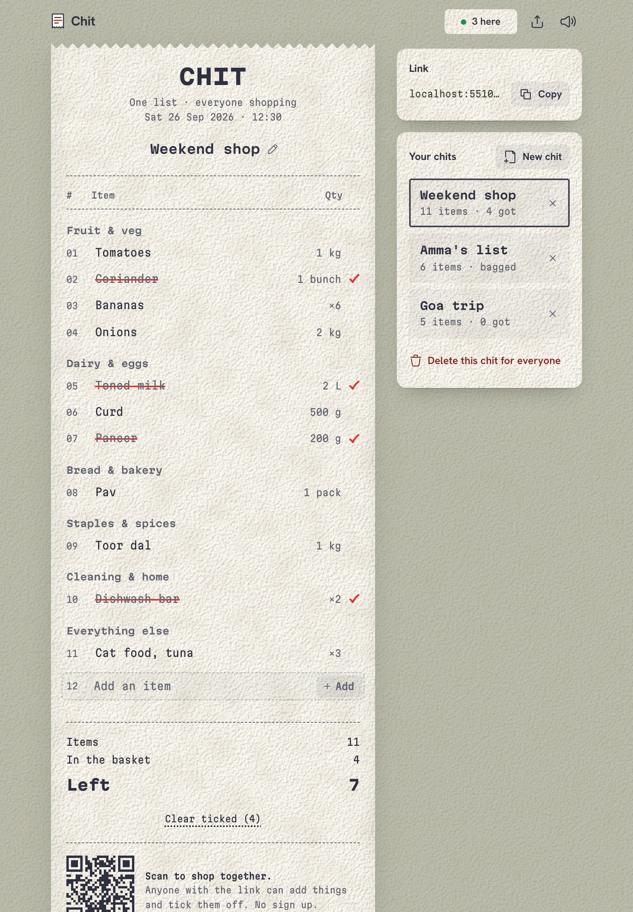
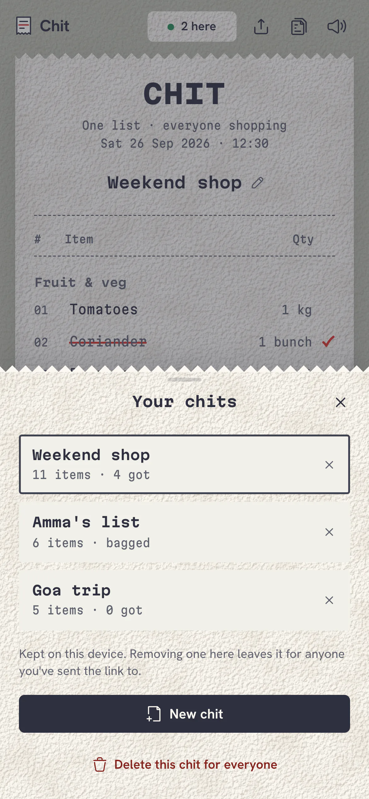
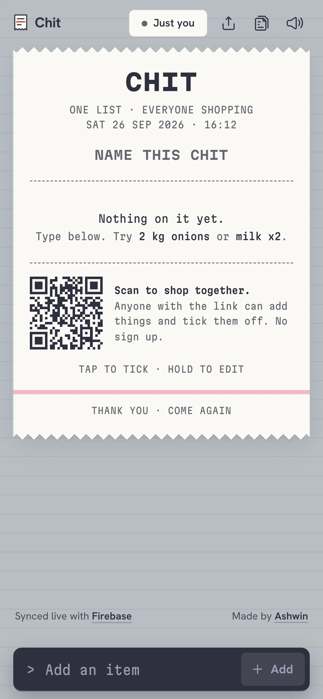
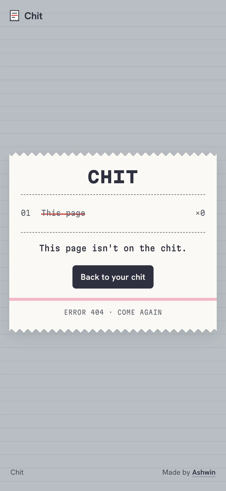

<p align="center">
  <a href="https://chit.ashwin.co.in">
    
  </a>
</p>

<p align="center">
  <a href="https://chit.ashwin.co.in"><strong>chit.ashwin.co.in</strong></a>
  &nbsp;·&nbsp;
  <a href="#what-it-does">what it does</a>
  &nbsp;·&nbsp;
  <a href="#one-list-many-phones">how it syncs</a>
  &nbsp;·&nbsp;
  <a href="#running-it">running it</a>
</p>

<br>

<p align="center">
  
</p>

the source of **[chit.ashwin.co.in](https://chit.ashwin.co.in)**, a shopping list you share. a chit is the slip of paper you hand over at the corner shop, so the list is printed like one: a till receipt that grows as you add things, and gets crossed off in red pen as you pick them up. send the link to whoever is shopping with you and every phone on it updates live.

it used to be called add to cart, and it was one list that everyone who opened the site shared. now every chit has its own private link.

it is one html file, one stylesheet and a few small modules. no framework and no build step. the lists live in the [firebase realtime database](https://firebase.google.com/docs/database); everything else happens in the browser.

## what it does

<p align="center">
  
  &nbsp;
  
  &nbsp;
  
</p>

- **type it how you'd say it.** `2 kg onions`, `onions 2kg`, `milk x2`, `6 bananas`, `half kg tomatoes` and `a dozen eggs` all come out as a name and a quantity. kg, g, l, ml, packs, bunches, bottles, dozens and a few more are understood.
- **sorted like a shop.** each item lands in a section (fruit and veg, dairy and eggs, bread, meat and fish, staples and spices, snacks and drinks, cleaning, personal care, everything else) from a word list that knows atta, dal, pav and harpic as well as bread and milk. wrong guess? move it in the edit sheet.
- **tap to tick.** a tap crosses the line off in red pen, and another tap brings it back. hold a line (or right click it) to edit or remove it.
- **live for everyone.** adds, ticks and edits show up on every phone with the chit open as they happen, and the top bar says how many people have it open.
- **one link, no accounts.** every chit has its own link. share it from the share button, or have someone scan the qr code printed at the foot of the receipt.
- **all got.** when the last line is ticked, the receipt gets stamped. clear ticked then takes the lot off in one go.
- **undo everything.** removing a line or clearing ticked ones shows a toast with undo, and `cmd` or `ctrl` + `z` steps back through ticks, edits, renames and adds.
- **your chits.** every chit you open or make is kept on your device, with its item count, to jump between the weekly shop and the trip list.
- **works in a shop with bad signal.** changes show at once and sync when the connection is back, the top bar says when you are offline, and the last copy of each chit is kept on the device so it opens instantly.
- **keyboard.** `/` to add, arrows to move between lines, `space` to tick, `e` to edit, `delete` to remove.
- **sounds.** a short thermal printer buzz when a line prints, a pen scratch when it is ticked and a thump for the stamp, made with the web audio api. they wait for your first tap, stay quiet under the ios silent switch, and mute in one tap.
- **a 404 that is crossed off**, and every chit sets the page title to its name.

## one list, many phones

a chit is one node in the realtime database:

```
lists/
  <chit id>/
    name      "Weekend shop"
    created   1790406000000
    items/
      <push id>  { text: "Onions", qty: "2 kg", section: "produce", got: false, at: ... }
presence/
  <chit id>/
    <tab id>   a timestamp while the tab is open
```

- **the id is the key.** a new chit gets 16 random characters from `crypto.getRandomValues`, about 80 bits, so links can't be guessed. the rules below let anyone read or write a chit whose id they know, and nobody list them.
- **nothing is written until you use it.** opening the site makes an id but writes nothing. the chit is saved when you add the first item or give it a name.
- **order comes free.** items are keyed by firebase push ids, which sort by time, so the receipt numbers stay stable. an undone delete writes the item back under its old key and it returns to the same line.
- **presence cleans itself up.** each tab writes itself under `presence/` with an `onDisconnect` remove, so the count drops when someone closes the tab or loses signal.
- **no flicker on load.** the receipt paints from the device copy first, then only lines that really changed animate in when the live data arrives.

### database rules

[`database.rules.json`](database.rules.json) holds the rules for `lists` and `presence`, with length checks on every field. to use your own database, paste them into the realtime database rules in the firebase console (merge them in beside any rules your other apps need) and change `databaseURL` in [`js/db.js`](js/db.js).

## the design

it looks like a till receipt because that is what a shopping list turns into.

- **the receipt.** a strip of thermal paper with torn edges, a double-width header, dashed rules, numbered lines, totals, a qr code where the barcode would be, the pink stripe real rolls print near their end, and "thank you, come again".
- **printed and crossed off.** items are set in ink, ticks are drawn in red pen over them, so the two actions never look alike.
- **the counter.** the receipt sits on the grey of a checkout counter, with the belt's lines behind it. there is no dark mode: a receipt is white paper.
- **type.** [martian mono](https://fonts.google.com/specimen/Martian+Mono) for everything on the paper. its width axis gives the wide header and totals real receipt printers use, and the narrow cut fits more on a phone. [hanken grotesk](https://fonts.google.com/specimen/Hanken+Grotesk) for the controls around it.
- **printing.** a new line prints left to right in steps, like a print head, while the lines under it slide down to make room. ticks draw the pen stroke across, and removed lines fade before the rest close up.
- **every screen.** one column on phones, the receipt and a side panel with your chits and the link on tablets, and three columns on desktop, with a wider receipt on big monitors. it was checked at 20 sizes from a 320 px iphone se to a 2560 px monitor, including landscape phones, with no sideways scroll and nothing clipped.
- **nothing jumps.** fonts are self-hosted and preloaded with metric-matched fallbacks, the receipt stays hidden until its data is in, and layout shift on load measures 0.

<details>
<summary><strong>more screenshots</strong></summary>

<br>



<p align="center">
  
  &nbsp;
  
  &nbsp;
  
</p>

</details>

## the stack

| layer | choices |
| --- | --- |
| markup and style | plain html and css |
| script | es modules in [`js/`](js), loaded straight by the browser |
| data | [firebase realtime database](https://firebase.google.com/docs/database), sdk 12 from the gstatic cdn |
| qr codes | [uqr](https://github.com/unjs/uqr), vendored in `js/vendor` |
| motion | css transitions and the web animations api |
| type | [martian mono](https://fonts.google.com/specimen/Martian+Mono) and [hanken grotesk](https://fonts.google.com/specimen/Hanken+Grotesk), self-hosted |
| icons | [iconoir](https://iconoir.com), inlined as an svg sprite |
| hosting | [vercel](https://vercel.com/), as static files |

## running it

there is nothing to install. the modules need to be served rather than opened as a file, so any static server works:

```sh
git clone https://github.com/Ashwin-S-Nambiar/Chit.git
cd Chit
python3 -m http.server 5173   # or: npx serve
```

then open http://localhost:5173.

## the shape of it

```
index.html          the page, the icon sprite and both sheets
index.css           tokens, then every component, in one file
404.html            the crossed off page
database.rules.json realtime database rules
js/
  main.js           state, the receipt, sheets, toasts, undo and keyboard
  db.js             firebase: lists, items, names and presence
  parse.js          quantities and sections from what you type
  qr.js             the share link as an svg path
  sheet.js          bottom sheets with drag to dismiss
  sound.js          web audio printer, pen and stamp
  store.js          your chits and the offline copy, in localStorage
  tip.js            tooltips for icon buttons
  vendor/uqr.js     qr encoder
fonts/              martian mono and hanken grotesk, latin and latin-ext
```

## known rough edges

- **anyone with the link can edit.** that is the point, but it also means a chit is only as private as the link.
- **offline changes live in memory.** they sync when the connection comes back, but closing the tab while offline loses them.
- **sections are a word list.** it knows a few hundred common items; anything else goes under everything else until you move it.

---

[chit.ashwin.co.in](https://chit.ashwin.co.in) · [ashwin.co.in](https://ashwin.co.in) · [notes](https://notes.ashwin.co.in) · [x](https://x.com/ashwinnambiar11) · [github](https://github.com/Ashwin-S-Nambiar)
